# Advanced NLP: NER, Topic Modeling & Transfer Learning

## Dataset

- **Name:** BBC News Dataset (2,225 articles, 5 categories: business, entertainment, politics, sport, tech)
- **Source used:** [BBC Articles Dataset with Extra Features](https://www.kaggle.com/datasets/jacopoferretti/bbc-articles-dataset) (Kaggle)
- **Files in `data/`:**
  - `bbc-news-data.csv` — the core dataset (category, title, article text) used for all three parts
  - `bbc_news_text_complexity_summarization.csv` — readability scores + extractive summaries per article, used in the Bonus 2 readability analysis
  - `bbc_text_cls.csv` — text + label pairs (supplementary, included for completeness)

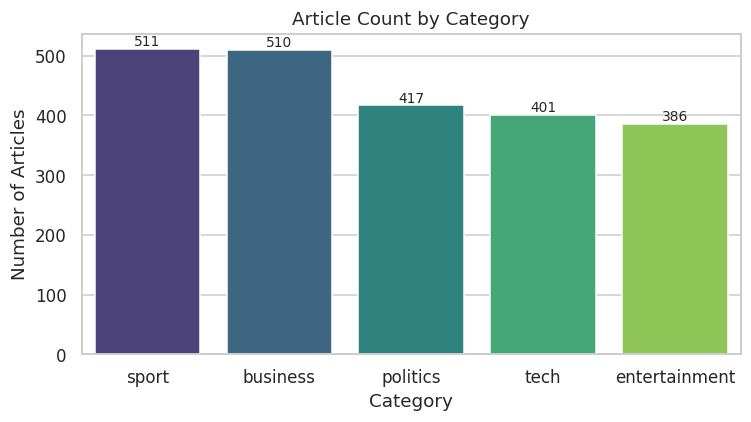

## Project Structure

```
.
├── notebooks/
│   └── week6_advanced_nlp.ipynb   # full analysis, all cells run, outputs visible
├── data/                          # dataset CSVs
├── outputs/                       # all charts exported as PNGs
├── models/                        # best-performing saved model (joblib)
├── requirements.txt
└── README.md
```

## How to Run

```bash
pip install -r requirements.txt
python -m spacy download en_core_web_sm
python -m spacy download en_core_web_md
jupyter notebook notebooks/week6_advanced_nlp.ipynb
```

> The notebook was built and executed in a sandboxed environment without access to `huggingface.co`, so Part 3's optional Hugging Face zero-shot cell auto-skips there. Run it in **Google Colab** (or any environment with internet access) to also get true Transformer zero-shot results — no code changes needed.

## What's Inside

### Part 1 — Named Entity Recognition
Extracted entities with **spaCy (`en_core_web_sm`)** across all 2,225 articles, analyzed entity-type frequency overall and by category, and listed extracted entities for 5 example articles.

| Overall entity type frequency | Entity types by category |
|---|---|
| 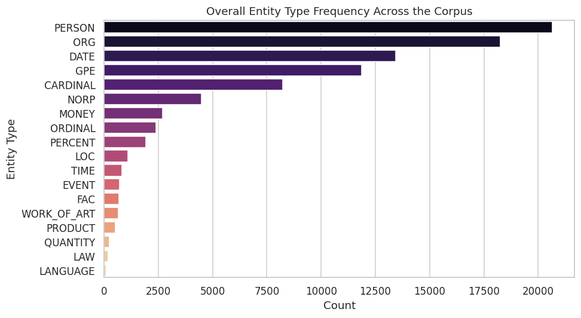 | 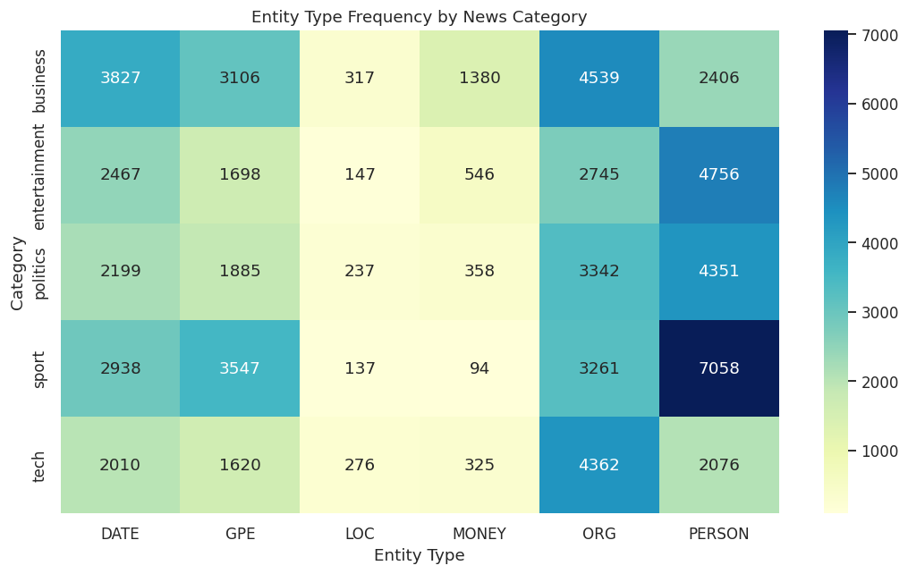 |

`PERSON` and `ORG` dominate the corpus. Breaking this down by category confirms the extraction is sensible: `sport`/`politics` skew toward `PERSON`, `business` skews toward `ORG`/`MONEY`.

Normalizing by category size (so raw article counts don't skew the comparison) makes the pattern even clearer — `sport` is the most `PERSON`-heavy category by share, `business` is the most `MONEY`-heavy, and `tech` leans hardest on `ORG`:

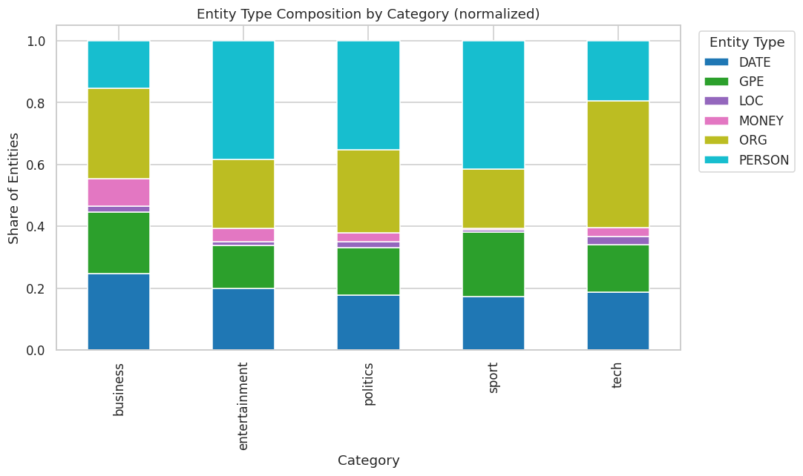

### Part 2 — Topic Modeling
Preprocessed text (lemmatize, stopword/punctuation removal via spaCy), then fit **LDA** models for k=2..10 topics and scored each with **coherence (c_v)** via `gensim` to justify the final topic count (k=5, coherence 0.51).

| Coherence vs. number of topics | Topic keywords |
|---|---|
| 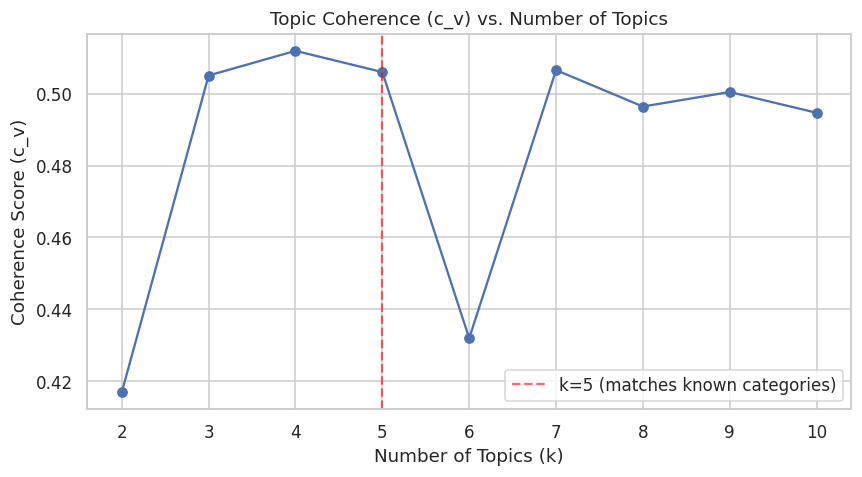 | 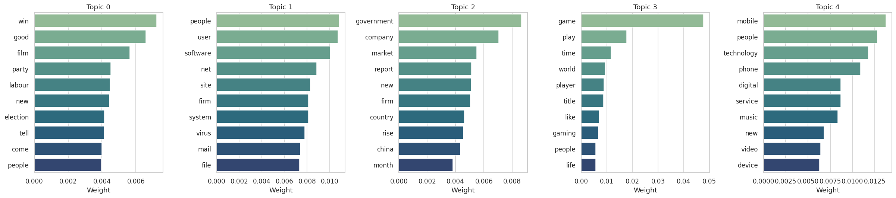 |

**Topic vs. actual category alignment** (cross-tabulation): overall topic purity **0.74**. Four of the five topics map strongly onto a single category — `business` (purity 0.80), `tech` (0.92 and 0.99 across two topics), and `sport` (0.60) all separate out cleanly. The exception is Topic 0, a mixed bucket spanning `sport` (444 articles), `entertainment` (361), and `politics` (322) at once (purity only 0.39) — these three share more general narrative/human-interest vocabulary than the more jargon-heavy `business`/`tech` categories, which makes them harder for a bag-of-words model to fully separate.

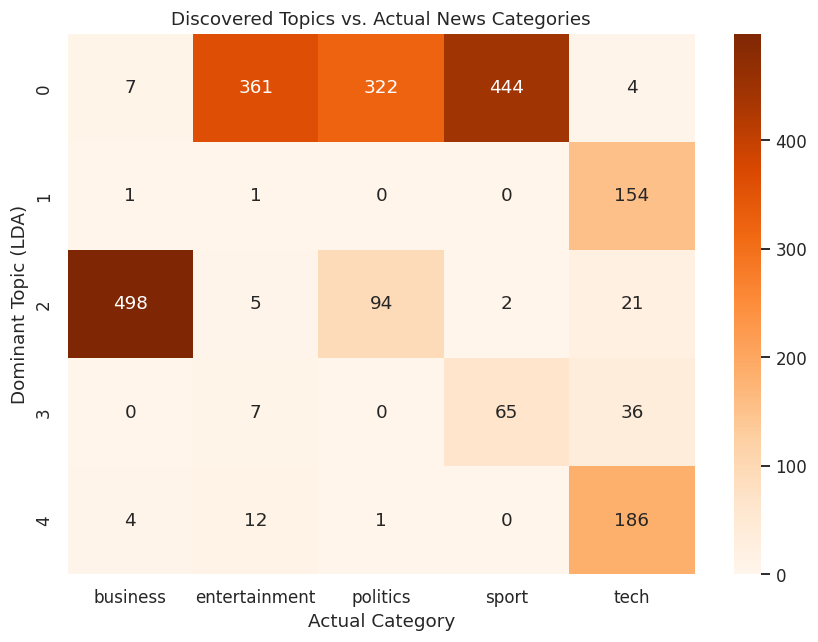

### Part 3 — Transfer Learning
**Approach:** feature extraction using spaCy's `en_core_web_md` pretrained word vectors (mean-pooled per article) + Logistic Regression, benchmarked against a traditional **TF-IDF + Logistic Regression** baseline. Both are evaluated with accuracy, precision, recall, and macro-F1; the notebook also includes an optional Hugging Face zero-shot (`facebook/bart-large-mnli`) cell that runs automatically wherever internet access is available.

| Model comparison | Confusion matrices |
|---|---|
| 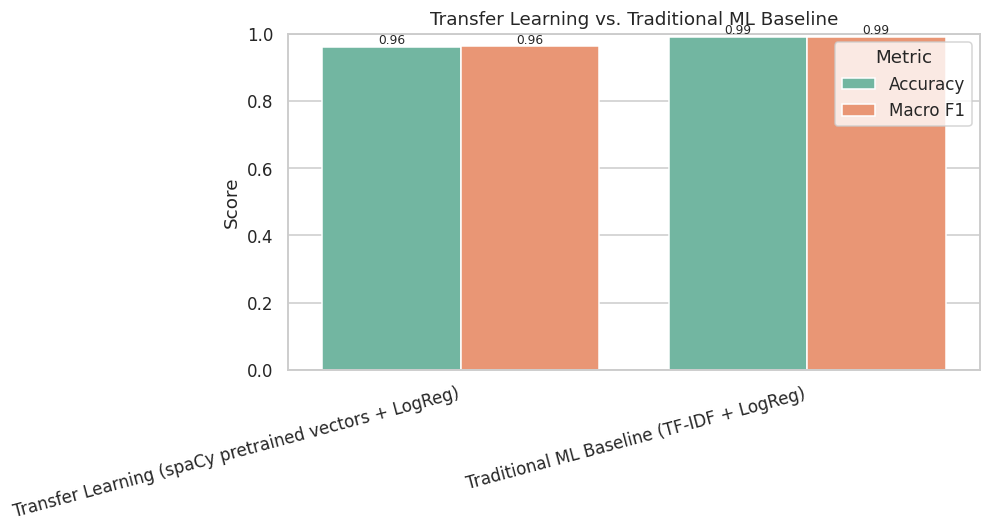 | 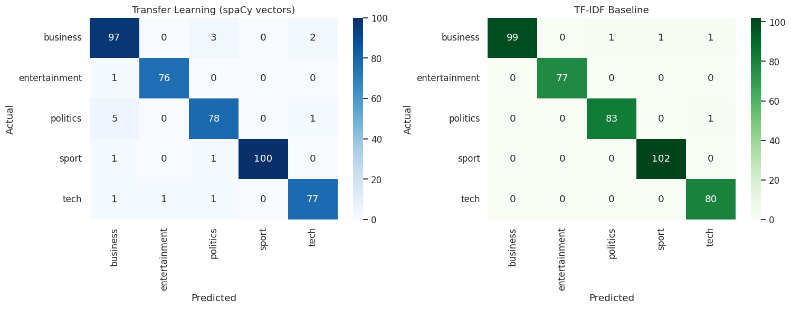 |

**Results:**

| Model | Accuracy | Macro F1 |
|---|---|---|
| Transfer Learning (spaCy pretrained vectors + LogReg) | 96.2% | 0.962 |
| Traditional ML Baseline (TF-IDF + LogReg) | **99.1%** | **0.991** |

The TF-IDF baseline edges out the embedding-based transfer-learning model here — on a well-separated, vocabulary-driven 5-class dataset like BBC News, sparse lexical features capture category-defining words (e.g. "election", "striker", "album") very directly, while mean-pooled dense embeddings smooth some of that signal away. The best model (TF-IDF baseline) is saved to `models/best_model_tfidf_baseline.joblib`.

### Bonus 1 — Word Clouds by Category
A quick qualitative cross-check against the LDA keyword lists.

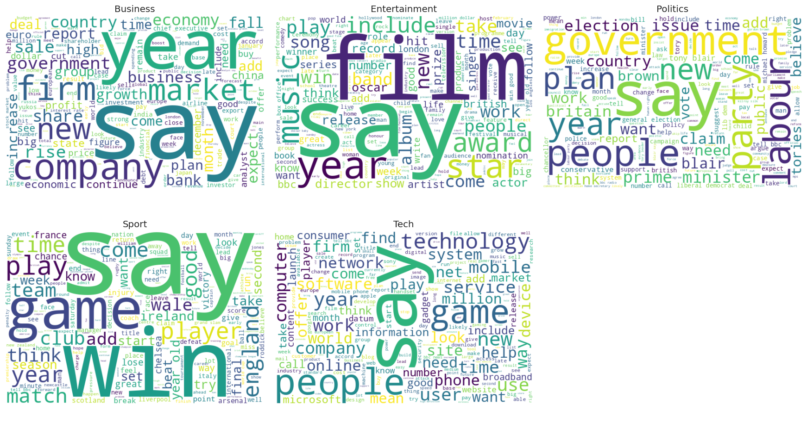

### Bonus 2 — Readability Analysis
Using the companion complexity dataset's Flesch Reading Ease and Dale-Chall scores, checked whether writing complexity differs by category — a genuinely useful editorial/media-analytics angle beyond the core task requirements.

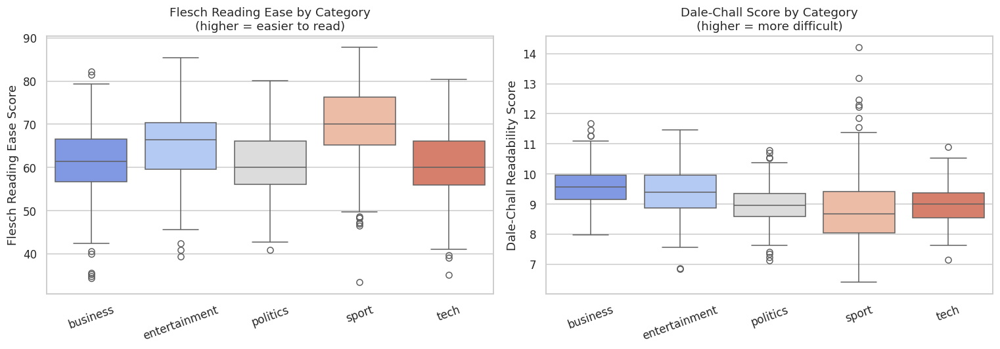

`tech` and `business` articles read as denser/more technical; `sport` and `entertainment` are easier reads — useful for a newsroom thinking about audience accessibility.

## Key Takeaways

- **NER** validates itself against domain intuition — entity-type mix per category matches what a human editor would expect.
- **Topic Modeling** recovers most of the dataset's real editorial structure with zero supervision (0.74 purity), and is honest about where it doesn't (entertainment/politics/sport overlap in narrative vocabulary).
- **Transfer Learning** performs strongly (96%) but is narrowly beaten by a well-tuned traditional TF-IDF baseline (99%) on this particular dataset — a reminder that "pretrained/deep" isn't automatically better than "simple/classical" for every task, especially smaller, vocabulary-driven, well-separated classification problems.
